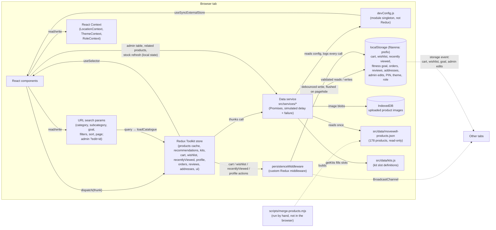
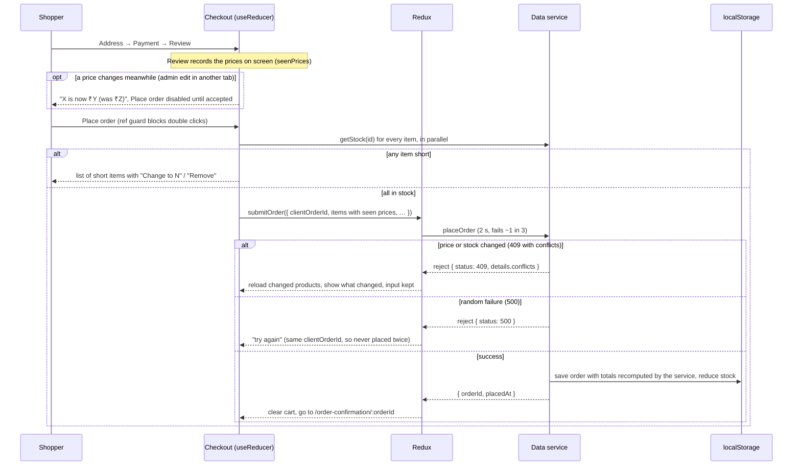
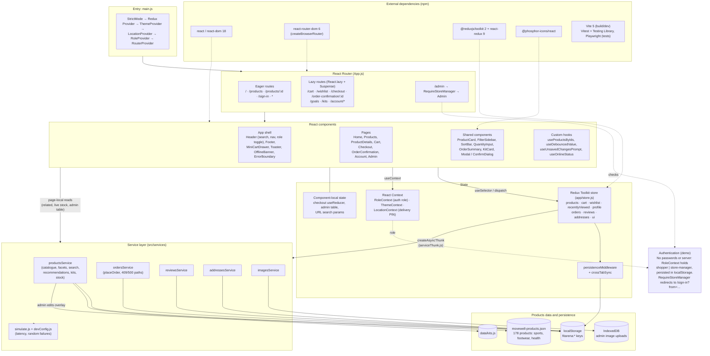
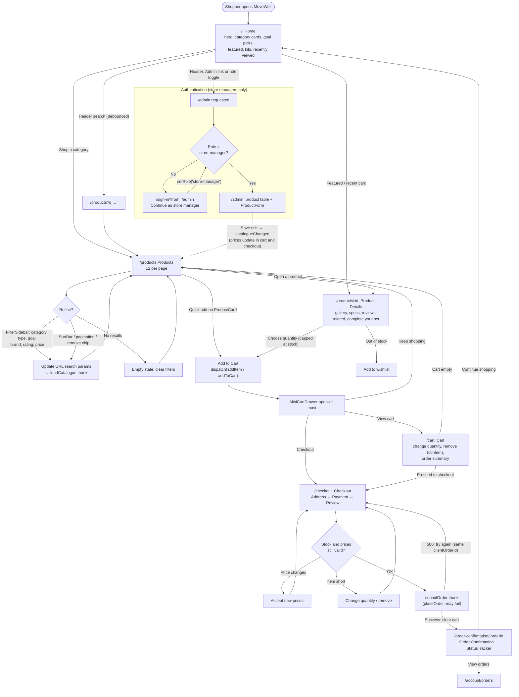
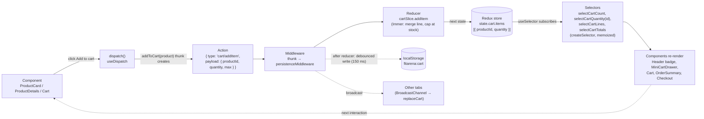
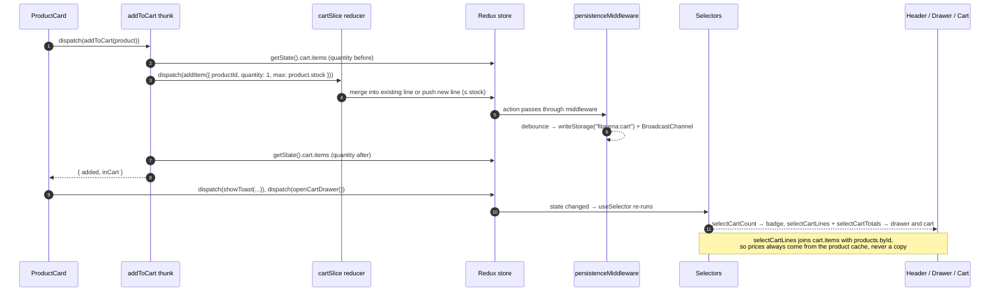

# MoveWell: Architecture

The state map and component tree for MoveWell, kept in step with the code (last checked 29 September 2026). MoveWell is the FitArena codebase extended with the StrideHub and MediKart catalogues. `specs.md` records FitArena's original plan, and `MERGE.md` records how the three stores were merged. Where the build differs from the plan, this file and `ADR.md` describe what was built.

## 1. System overview

There is no server. Everything below runs in one browser tab.



Components never touch the catalogue JSON, `localStorage` or IndexedDB for shop data. They go through the service, either directly for page-local data or through Redux thunks for shared state. Outside the service, only two things use storage directly: the persistence middleware, and the three Contexts, which store small preferences (PIN, theme, role). Both read through the validating `readStorage`.

**Unified catalogue.** `scripts/merge-products.mjs` combines FitArena (`products.json`), StrideHub (`StrideHub.json`) and MediKart (`MediKart.json`) into `movewell-products.json`. It does not modify the three source files. Each product's `category` is a department (`sports`, `footwear` or `health`), and its original store category becomes `subcategory`. Ids stay integers: FitArena keeps 1 to 62, StrideHub products get 1001 onwards and MediKart products 2001 onwards. `goals` tags (`running`, `gym`, `yoga`) drive the cross-category features. The schema and each decision are recorded in `MERGE.md` §3, and the conflicts found during the merge in `CONFLICTS.md`.

## 2. State map

| State | Where it lives | Written by | Read by |
|---|---|---|---|
| Catalogue page (products, total, status, error) | `productsSlice.items/total/status` | `loadCatalogue` thunk (products + departments + facets together, latest request only) | Home, Products |
| Product cache | `productsSlice.byId`, `detailStatus` | every catalogue, recommendation and kit load; `fetchProduct` (skipped when cached) | Product detail, cart, drawer, checkout, wishlist, recently viewed (via `useProductsByIds`) |
| Catalogue version | `productsSlice.catalogueVersion` | `catalogueChanged` (admin save here, or storage event from another tab) | pages reload when it changes |
| Departments and facet counts | `productsSlice.categories`, `facets` (department, subcategory and brand counts; subcategories and brands scoped to the chosen department) | `loadCatalogue` | Filter sidebar, Home "Shop by category" and "Browse by type" |
| Recommendations | `productsSlice.recommendations[goal]` (`{ ids, status }`, keyed by goal, `""` for the featured mix) | `loadRecommendations` | `Recommendations` (Home featured row, Goals page) |
| MoveWell Kits | `productsSlice.kits` (`{ items, status }`) | `loadKits` (slots filled from the live catalogue) | `KitCard` on Home, Goals and Kits pages |
| Fitness goal | `profileSlice.goal` (`"running"`, `"gym"`, `"yoga"` or none), persisted and synced across tabs | `GoalPicker`, Account → Preferences, cross-tab `replaceGoal` | Home, Goals page, recommendations |
| Filters, sort, page, search | URL search params (`category`, `subcategory`, `goal`, `brand`, `minRating`, `minPrice`, `maxPrice`, `sort`, `page`, `q`) | Header search and nav, filter sidebar, sort bar, chips, pagination | Products page, header nav highlight |
| Cart lines `{productId, quantity}` | `cartSlice` (one cart for every department) | add, merge (capped at stock), `addKitToCart`, +/− (`changeQuantity`), set, remove, clear, cross-tab replace | Header badge, drawer, cart, product page "In your cart", checkout |
| Cart totals | derived: `selectCartTotals` (memoized) | never stored | Cart, drawer, checkout |
| Wishlist ids | `wishlistSlice` | `toggleWishlist` (optimistic, rolls back on failure) | Cards, product page, header badge, Wishlist page |
| Recently viewed ids | `recentlyViewedSlice` | product page once the product loads; "forget" on the home row | Home |
| Orders | `ordersSlice.list` (+ `placeStatus`) | `submitOrder`, `fetchOrders`, `fetchOrder`, `cancelOrderThunk` | Confirmation, Account → Orders |
| Order status | derived from `placedAt` (`utils/orderStatus.js`) | never stored, except "Cancelled" | Status tracker, Account → Orders |
| Reviews | `reviewsSlice.byProductId` | `fetchReviews`, `submitReview` | Product page Reviews tab |
| Addresses | `addressesSlice` | fetch, add, edit, remove thunks | Checkout, Account → Addresses |
| Toasts, drawer open | `uiSlice` (toast callbacks in a map outside Redux) | `showToast`, `showActionToast`, drawer actions | Toaster, MiniCartDrawer |
| Delivery PIN | `LocationContext` | header PIN form | Product page, cart, checkout |
| Theme preference | `ThemeContext` (+ inline script before paint) | Account → Preferences, header select | `<html data-theme>` |
| Role (shopper / store manager) | `RoleContext` | header checkbox, sign-in page | `RequireStoreManager`, header admin link |
| Dev settings and call log | `devConfig.js` singleton | developer controls | `simulate()`, developer controls |
| Checkout draft (step, addresses, payment, card, errors, clientOrderId) | `useReducer` in Checkout (`checkoutReducer.js`) | form fields, step buttons | Checkout only; card data is never stored |
| Prices shown on Review | Checkout `seenPrices` state | set when Review opens; "Use the new prices" | Checkout price-change notice (L7) |
| Admin table (search, sort, category filter, page, selection, pending deletes) | Admin component state | table controls | Admin only |
| Product being edited | URL `?edit=id` / `?new=1` | table Edit, Add product | Admin form (`key` = id) |
| Admin form values (category, type, goals, …) | the form's own inputs (uncontrolled), read with FormData on save | typing | ProductForm on submit |
| Related products, "Complete your set", live stock | ProductDetails local state | service calls in effects | Product page only |

## 3. Component tree

```mermaid
flowchart TD
    Main["main.js\nStrictMode → Redux Provider → Theme/Location/Role providers → RouterProvider"]
    Main --> App["App\nSkip link, OfflineBanner, Header, main, Footer, DevControls, Toaster, MiniCartDrawer"]
    App --> EB["ErrorBoundary (keyed per page) → Suspense → Routes"]

    EB --> Home["/  Home (MoveWell landing page)"]
    Home --> Hero["Hero: Shop Sports / Footwear / Health"]
    Home --> Cats["Shop by category cards"]
    Home --> GP["GoalPicker + Recommendations (goal picks)"]
    Home --> Recent["Recently viewed → ProductCard (View again / forget)"]
    Home --> Featured["Featured across MoveWell → Recommendations → ProductCard"]
    Home --> HKits["MoveWell Kits → KitCard"]
    Home --> Types["Browse by type, Why MoveWell"]

    EB --> Products["/products  Products"]
    Products --> Filters["FilterSidebar (Category, Type, Fitness goal, Brand, Rating, PriceRange)"]
    Products --> Sort["SortBar (count, chips)"]
    Products --> Grid["ProductCard × 12 (department chip)"]

    EB --> Detail["/products/:id  ProductDetails"]
    Detail --> Gallery["Gallery"]
    Detail --> InCart["InYourCart (L4)"]
    Detail --> Qty["QuantityInput (useImperativeHandle)"]
    Detail --> Tabs["Tabs → TabList, Tab, TabPanel\n(specs ordered per department)"]
    Tabs --> Reviews["ReviewList → StarRatingInput"]
    Detail --> Set["Complete your … set (same goal, other departments)"]
    Detail --> Related["RelatedProducts → ProductCard (View details)"]

    EB --> Goals["/goals  Goals (lazy) → GoalPicker, Recommendations, KitCard"]
    EB --> Kits["/kits  Kits (lazy) → KitCard × 3"]

    EB --> Cart["/cart  Cart (lazy)"]
    Cart --> CartRow["CartRow × n → QuantityInput"]
    Cart --> Summary1["OrderSummary"]

    EB --> Wish["/wishlist  Wishlist (lazy) → ProductCard (Move to cart / Remove)"]

    EB --> Checkout["/checkout  Checkout (lazy)"]
    Checkout --> Stepper["Stepper"]
    Checkout --> Addr["AddressFields × 2 (delivery, billing), SavedAddressEditor"]
    Checkout --> Summary2["OrderSummary"]

    EB --> Confirm["/order-confirmation/:id  OrderConfirmation (lazy) → StatusTracker"]
    EB --> Account["/account  AccountLayout (lazy)"]
    Account --> AO["orders → AccountOrders"]
    Account --> AA["addresses → AccountAddresses → AddressFields"]
    Account --> AP["preferences → AccountPreferences (theme, fitness goal)"]
    EB --> SignIn["/sign-in  SignIn"]
    EB --> Guard["/admin  RequireStoreManager → Admin (lazy)"]
    Guard --> Table["products table (Category and Type columns, category filter)"]
    Guard --> Form["ProductForm (uncontrolled, FormData on submit;\nCategory select, Type, Fitness goals)"]
    EB --> NF["*  NotFound"]

    Modal["Modal (portal): the one dialog shell"] -.-> Confirm2["ConfirmDialog"]
    Modal -.-> Drawer["MiniCartDrawer"]
    Confirm2 -.->|used by| Cart
    Confirm2 -.->|used by| Checkout
    Confirm2 -.->|used by| Guard
```



`ProductCard` is one memoized component used in five places, each passing its own `actions`: the grid and recommendation rows (Add to cart), Related (View details), Recently viewed (View again / forget) and Wishlist (Move to cart / Remove).

`KitCard` shows a kit's items across all three departments with one "Add kit to cart" button. That button dispatches `addKitToCart`, which calls the existing stock-capped `addToCart` once per product. A kit therefore becomes ordinary lines in the one cart, with no bundle price.

`HeroCarousel.js` is no longer used by the home page but was left in place (`MERGE.md` §6).

## 4. Data flow: placing an order

The flow is unchanged from FitArena and is the same for every department.



## 5. Folder structure

```
scripts/
├── merge-products.mjs        builds movewell-products.json and the footwear/health SVG images
└── generate-products.mjs, assignImages.mjs   FitArena's original data helpers
src/
├── main.js, App.js           entry, providers, routes
├── app/                      store.js, persistenceMiddleware.js, crossTabSync.js, routerFuture.js
├── services/                 simulate.js, devConfig.js, productsService.js (catalogue, facets,
│                             recommendations, kits), ordersService.js, reviewsService.js,
│                             addressesService.js, imagesService.js
├── features/                 Redux slices: products/, cart/, wishlist/, recentlyViewed/, profile/,
│                             orders/, reviews/, addresses/, ui/; serviceThunk.js;
│                             checkout/ (reducer + validation); admin/ (form validation)
├── context/                  LocationContext, ThemeContext, RoleContext
├── hooks/                    useDebouncedValue, useMediaQuery, usePageView, useOnlineStatus,
│                             useProductsByIds, useMinimumDelay, useProductImage, useUnsavedChangesPrompt
├── components/               shared UI (ProductCard, GoalPicker, Recommendations, KitCard, Modal,
│                             ConfirmDialog, MiniCartDrawer, Tabs, QuantityInput, StarRatingInput,
│                             ReviewList, Toaster, StatusTracker, catalogueIcons, …)
├── pages/                    route components (incl. Goals, Kits); account/ and admin/ sub-folders
├── utils/                    storage (validated reads), catalogue (departments, goals, labels),
│                             pricing, delivery, orderStatus, rupee, shopper, safeReturnPath, siteImages
├── data/                     movewell-products.json (merged seed), products.json (FitArena),
│                             StrideHub.json, MediKart.json (sources), kits.js
└── test/setup.js             test environment fixes
public/images/                FitArena photos; footwear/ and health/ generated SVG cards
fonts.css                     self-hosted Oswald and Barlow
docs/                         specs, this file, ADR, merge record, conflicts, team, level-ups,
                              edge cases, code review, AI journal, security, test plan, peer tests,
                              wireframes/, team presentation
e2e/selftest.mjs              Playwright self-test (written against the FitArena build, see TEST_PLAN.md)
```

## 6. Settled items

- CSS approach: CSS Modules plus shared design tokens in `index.css`. The tokens were re-themed for MoveWell (deep-teal accent, one colour per department) and the structure is unchanged (`MERGE.md` §5).
- Router: data router so unsaved changes can be guarded (ADR 6). The departments reuse `/products?category=…`, and only `/goals` and `/kits` were added (ADR 9).
- Storage keys keep the `fitarena:` prefix so carts saved before the merge still load (`CONFLICTS.md` §5).
- Hosting: not decided. `npm run preview` serves the production build; a Vercel deploy needs a rewrite of all paths to `index.html`.

## 7. High-level architecture

The layers from the browser down to the data, and the libraries each layer depends on. §1 shows the same system at storage level; this view is by layer.



**Authentication.** MoveWell has no real authentication (out of scope, `specs.md` §11). The only access control is the role in `RoleContext`. Shoppers can browse, fill the cart and check out without signing in. Only `/admin` is protected: `RequireStoreManager` sends shoppers to `/sign-in?from=/admin`, and switching role there (or with the header toggle) returns them to the page they asked for, after `safeReturnPath` checks it.

## 8. User workflow

The main shopping path, Home → Products → Product Details → Add to Cart → Cart → Checkout → Order Confirmation, with search, filtering and the sign-in branch.



Shoppers never need to sign in: the cart, checkout and account pages are open to everyone. Checkout with an empty cart shows an empty state that links back to the shop, and `/order-confirmation` with an unknown id redirects home.

## 9. Redux Toolkit data flow (cart example)

Every Redux update follows one loop: a component dispatches an action, the slice reducer produces the next state, the store notifies subscribers, and selectors hand each component the part of state it reads.



The same flow step by step, for adding a product to the cart from a product card:



| Step | Cart example | File |
|---|---|---|
| Component | `ProductCard` "Add to cart", `ProductDetails` quantity form, `Cart` +/− and remove | `components/ProductCard.js`, `pages/ProductDetails.js`, `pages/Cart.js` |
| dispatch | `dispatch(addToCart(product))`, `dispatch(changeQuantity({ productId, delta, max }))` | same |
| Action | `cart/addItem`, `cart/changeQuantity`, `cart/setQuantity`, `cart/removeItem`, `cart/clearCart`, `cart/replaceCart` (cross-tab only) | `features/cart/cartSlice.js` (generated by `createSlice`) |
| Reducer | merges lines, clamps to `[1, stock]`, never stores product copies | `features/cart/cartSlice.js` |
| Store | `state.cart.items`, initialised from validated `localStorage` | `app/store.js` |
| Middleware | persists `cart/*` (except `replaceCart`) and broadcasts to other tabs | `app/persistenceMiddleware.js`, `app/crossTabSync.js` |
| Selector | `selectCartItems`, `selectCartCount`, `selectCartQuantity(id)`, `selectCartLines`, `selectCartReady`, `selectCartTotals` | `features/cart/cartSlice.js` |
| Component | Header badge, `MiniCartDrawer`, `Cart`, `OrderSummary`, `Checkout` | `components/`, `pages/` |
