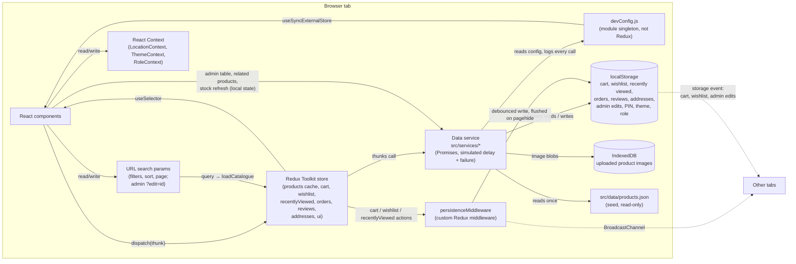

# FitArena: Architecture

The state map and component tree the brief asks for under `docs/`, kept in step with the code (last checked 27 September 2026). `specs.md` records the original plan; where the build differs, this file and `APPROACH_DECISIONS.md` describe what was built.

## 1. System overview

No server exists. Everything below runs in one browser tab.



Components never touch `products.json`, `localStorage` or IndexedDB for shop data. They go through the service (directly for page-local data, or through Redux thunks for shared state). The only direct storage users outside the service are the persistence middleware and the three Contexts, which store tiny preferences (PIN, theme, role), and all of them read through the validating `readStorage`.

## 2. State map

| State | Where it lives | Written by | Read by |
|---|---|---|---|
| Catalogue page (products, total, status, error) | `productsSlice.items/total/status` | `loadCatalogue` thunk (products + categories + facets together, latest request only) | Home, Products |
| Product cache | `productsSlice.byId`, `detailStatus` | every catalogue load, `fetchProduct` (skipped when cached) | Product detail, cart, drawer, checkout, wishlist, recently viewed (via `useProductsByIds`) |
| Catalogue version | `productsSlice.catalogueVersion` | `catalogueChanged` (admin save here, or storage event from another tab) | pages reload when it changes |
| Categories and counts | `productsSlice.categories`, `facets` | `loadCatalogue` | Filter sidebar, "Shop by sport" |
| Filters, sort, page, search | URL search params | Header search, filter sidebar, sort bar, chips, pagination | Products page, header nav highlight |
| Cart lines `{productId, quantity}` | `cartSlice` | add, merge (capped at stock), +/− (`changeQuantity`), set, remove, clear, cross-tab replace | Header badge, drawer, cart, product page "In your cart", checkout |
| Cart totals | derived: `selectCartTotals` (memoized) | never stored | Cart, drawer, checkout |
| Wishlist ids | `wishlistSlice` | `toggleWishlist` (optimistic, rolls back on failure) | Cards, product page, header badge, Wishlist page |
| Recently viewed ids | `recentlyViewedSlice` | product page once the product loads; "forget" on the home row | Home |
| Orders | `ordersSlice.list` (+ `placeStatus`) | `submitOrder`, `fetchOrders`, `fetchOrder`, `cancelOrderThunk` | Confirmation, Account → Orders |
| Order status | derived from `placedAt` (`utils/orderStatus.js`) | never stored, except "Cancelled" | Status tracker, Account → Orders |
| Reviews | `reviewsSlice.byProductId` | `fetchReviews`, `submitReview` | Product page Reviews tab |
| Addresses | `addressesSlice` | fetch, add, edit, remove thunks | Checkout, Account → Addresses |
| Toasts, drawer open | `uiSlice` (toast callbacks in a map outside Redux) | `showToast`, `showActionToast`, drawer actions | Toaster, MiniCartDrawer |
| Delivery PIN | `LocationContext` | header PIN form | Product page, cart, checkout |
| Theme preference | `ThemeContext` (+ inline script before paint) | Account → Preferences, header select | `<html data-theme>` |
| Role (shopper / store manager) | `RoleContext` | header checkbox, sign-in page | `RequireStoreManager`, header admin link |
| Dev settings and call log | `devConfig.js` singleton | developer controls | `simulate()`, developer controls |
| Checkout draft (step, addresses, payment, card, errors, clientOrderId) | `useReducer` in Checkout (`checkoutReducer.js`) | form fields, step buttons | Checkout only; card data is never stored |
| Prices shown on Review | Checkout `seenPrices` state | set when Review opens; "Use the new prices" | Checkout price-change notice (L7) |
| Admin table (search, sort, page, selection, pending deletes) | Admin component state | table controls | Admin only |
| Product being edited | URL `?edit=id` / `?new=1` | table Edit, Add product | Admin form (`key` = id) |
| Admin form values | the form's own inputs (uncontrolled), read with FormData on save | typing | ProductForm on submit |
| Related products, live stock | ProductDetails local state | service calls in effects | Product page only |

## 3. Component tree

```mermaid
flowchart TD
    Main["main.js\nStrictMode → Redux Provider → Theme/Location/Role providers → RouterProvider"]
    Main --> App["App\nSkip link, OfflineBanner, Header, main, Footer, DevControls, Toaster, MiniCartDrawer"]
    App --> EB["ErrorBoundary (keyed per page) → Suspense → Routes"]

    EB --> Home["/  Home"]
    Home --> Hero["HeroCarousel"]
    Home --> Tiles["Collection tiles"]
    Home --> Recent["Recently viewed → ProductCard (View again / forget)"]
    Home --> Featured["Featured → ProductCard (Add to cart)"]

    EB --> Products["/products  Products"]
    Products --> Filters["FilterSidebar (PriceRange)"]
    Products --> Sort["SortBar (count, chips)"]
    Products --> Grid["ProductCard × 12"]

    EB --> Detail["/products/:id  ProductDetails"]
    Detail --> Gallery["Gallery"]
    Detail --> InCart["InYourCart (L4)"]
    Detail --> Qty["QuantityInput (useImperativeHandle)"]
    Detail --> Tabs["Tabs → TabList, Tab, TabPanel"]
    Tabs --> Reviews["ReviewList → StarRatingInput"]
    Detail --> Related["RelatedProducts → ProductCard (View details)"]

    EB --> Cart["/cart  Cart (lazy)"]
    Cart --> CartRow["CartRow × n → QuantityInput"]
    Cart --> Summary1["OrderSummary"]

    EB --> Wish["/wishlist  Wishlist (lazy) → ProductCard (Move to cart / Remove)"]

    EB --> Checkout["/checkout  Checkout (lazy)"]
    Checkout --> Stepper["Stepper"]
    Checkout --> Addr["AddressFields × 2 (delivery, billing), SavedAddressEditor"]
    Checkout --> Summary2["OrderSummary"]

    EB --> Confirm["/order-confirmation/:id  OrderConfirmation (lazy) → StatusTracker"]
    EB --> Account["/account  AccountLayout (lazy)"]
    Account --> AO["orders → AccountOrders"]
    Account --> AA["addresses → AccountAddresses → AddressFields"]
    Account --> AP["preferences → AccountPreferences"]
    EB --> SignIn["/sign-in  SignIn"]
    EB --> Guard["/admin  RequireStoreManager → Admin (lazy)"]
    Guard --> Table["products table"]
    Guard --> Form["ProductForm (uncontrolled, FormData on submit)"]
    EB --> NF["*  NotFound"]

    Modal["Modal (portal): the one dialog shell"] -.-> Confirm2["ConfirmDialog"]
    Modal -.-> Drawer["MiniCartDrawer"]
    Confirm2 -.->|used by| Cart
    Confirm2 -.->|used by| Checkout
    Confirm2 -.->|used by| Guard
```



`ProductCard` is one memoized component used in four places, each passing its own `actions`: the grid (Add to cart), Related (View details), Recently viewed (View again / forget) and Wishlist (Move to cart / Remove).

## 4. Data flow: placing an order

```mermaid
sequenceDiagram
    participant U as Shopper
    participant C as Checkout (useReducer)
    participant R as Redux
    participant S as Data service
    participant L as localStorage

    U->>C: Address → Payment → Review
    Note over C: Review records the prices on screen (seenPrices)
    opt a price changes meanwhile (admin edit in another tab)
        C-->>U: "X is now ₹Y (was ₹Z)", Place order disabled until accepted
    end
    U->>C: Place order (ref guard blocks double clicks)
    C->>S: getStock(id) for every item, in parallel
    alt any item short
        C-->>U: list of short items with "Change to N" / "Remove"
    else all in stock
        C->>R: submitOrder({ clientOrderId, items with seen prices, … })
        R->>S: placeOrder (2 s, fails ~1 in 3)
        alt price or stock changed (409 with conflicts)
            S-->>R: reject { status: 409, details.conflicts }
            R-->>C: reload changed products; show what changed; input kept
        else random failure (500)
            S-->>R: reject { status: 500 }
            R-->>C: "try again" (same clientOrderId, so never placed twice)
        else success
            S->>L: save order with totals recomputed by the service; reduce stock
            S-->>R: { orderId, placedAt }
            R-->>C: clear cart, go to /order-confirmation/:orderId
        end
    end
```

## 5. Folder structure

```
src/
├── main.js, App.js           entry, providers, routes
├── app/                      store.js, persistenceMiddleware.js, crossTabSync.js, routerFuture.js
├── services/                 simulate.js, devConfig.js, productsService.js, ordersService.js,
│                             reviewsService.js, addressesService.js, imagesService.js
├── features/                 Redux slices: products/, cart/, wishlist/, recentlyViewed/, orders/,
│                             reviews/, addresses/, ui/; serviceThunk.js;
│                             checkout/ (reducer + validation); admin/ (form validation)
├── context/                  LocationContext, ThemeContext, RoleContext
├── hooks/                    useDebouncedValue, useMediaQuery, usePageView, useOnlineStatus,
│                             useProductsByIds, useMinimumDelay, useProductImage, useUnsavedChangesPrompt
├── components/               shared UI (ProductCard, Modal, ConfirmDialog, MiniCartDrawer, Tabs,
│                             QuantityInput, StarRatingInput, ReviewList, Toaster, StatusTracker, …)
├── pages/                    route components; account/ and admin/ sub-folders
├── utils/                    storage (validated reads), pricing, delivery, orderStatus, rupee,
│                             shopper, safeReturnPath, siteImages
├── data/products.json        seed catalogue
└── test/setup.js             test environment fixes
fonts.css                     self-hosted Oswald and Barlow
docs/                         brief, specs, this file, ADR, decisions, level-ups, edge cases,
                              code review, AI journal, security, test plan, peer tests, wireframes/
```

## 6. Settled items

- CSS approach: CSS Modules plus shared design tokens in `index.css` (ADR decision log).
- Router: data router so unsaved changes can be guarded (ADR 6).
- Hosting: not decided. `npm run preview` serves the production build; a Vercel deploy needs a rewrite of all paths to `index.html`.
